# 🔄 Workflow de Automatización de ETL de Ventas (HubSpot ➔ Python ➔ Google Sheets)

Este repositorio contiene la configuración e instrucciones de un **Workflow en n8n** diseñado para automatizar la extracción, transformación, limpieza y carga (ETL) de datos de negocios (*deals*) provenientes de **HubSpot** hacia **Google Sheets**, pasando por un microservicio de limpieza avanzada en **Python**.

---

## 🎯 Objetivo del Proyecto

Eliminar el trabajo manual de exportación y limpieza de reportes comerciales. El sistema extrae registros masivos desde HubSpot, normaliza identificadores técnicos (pipelines, etapas y propietarios) a nombres legibles, aplica reglas de negocio a través de un microservicio en Python y consolida los datos procesados en Google Sheets para alimentar tableros en **Looker Studio**.

---

## 🛠️ Arquitectura del Pipeline (9 Nodos)

```mermaid
graph LR
    A[1. Manual Trigger] --> B[2. Extraer HubSpot Deals]
    B --> C[3. Filtrar Pipelines/Etapas]
    C --> D[4. Parsear IDs a Nombres]
    D --> E[5. Formatear Payload JSON]
    E --> F[6. Microservicio Python POST]
    F --> G[7. Limpiar Google Sheets]
    G --> H[8. Parsear CSV a JSON]
    H --> I[9. Cargar Datos en Google Sheets]

```



### Flujo de Ejecución Detallado:

1. **Ejecutar 'workflow':** Trigger manual de activación.


2. **Extraer datos de HubSpot:** Conexión vía API Token que descarga los negocios con 24 propiedades (ARR, MRR, GMV, propietario, país, etapa, etc.).


3. **Extraer datos requeridos:** Filtrado lógico por código JS de pipelines (`CUSTOM` y `Platforms`) y etapas activas validadas.


4. **Parsear datos:** Decodificación mediante diccionarios en JavaScript para transformar IDs en nombres legibles (ej: `"93704483"` ➔ `"1. Target"`).


5. **Convertir datos en formato JSON:** Estructuración del arreglo para envío HTTP.


6. **Llamar a microservicio de Python:** Solicitud `POST` a contenedor Docker (`[http://host.docker.internal:8000/process](http://host.docker.internal:8000/process)`) que ejecuta enriquecimiento de datos y métricas temporales (duración en etapas, ciclo de venta, etc.).


7. **Limpiar hoja:** Vaciado preventivo de celdas en el rango `A2:AC` en Google Sheets para evitar duplicidades.


8. **Parsear CSV:** Decodificación del string `base64` retornado por Python a objetos JSON legibles por n8n.


9. **Colocar nuevos datos sobre la hoja:** Inserción masiva de 29 columnas procesadas en Google Sheets.


---

## 📋 Requisitos Previos

* **n8n:** Instancia ejecutándose en Docker o Cloud.


* **Microservicio en Python:** Servicio local o en contenedor corriendo en el puerto `8000` con el endpoint `/process` activo.


* **HubSpot App Token:** Credencial de acceso a la API con permisos de lectura sobre el objeto *Deals*.


* **Google Sheets API:** Credenciales OAuth2 habilitadas en n8n para lectura/escritura.


---

## ⚙️ Mantenimiento y Modificaciones Comunes

### 👥 Agregar un nuevo Ejecutivo de Ventas

En el nodo **Parsear datos**, agrega el ID interno de HubSpot y el nombre dentro del objeto `ownerMap`:

``
const ownerMap = {
  "123456789: "Pepito Perez",
  "NUEVO_ID_HUBSPOT": "Nombre del Ejecutivo" // Add new owner here
};
``

### 📊 Agregar o Modificar Pipelines
Modifica la matriz de IDs permitidos en **Extraer datos requeridos** y el mapeo en **Parsear datos**:
``// Node: Extraer datos requeridos
const allowedPipelines = ["45415243", "42942289", "NUEVO_PIPELINE_ID"];

// Node: Parsear datos
const pipelineMap = {
  "45415243": "CUSTOM",
  "42942289": "Platforms",
  "NUEVO_PIPELINE_ID": "Nombre Visible"
};
``

---

## 🔍 Solución de Problemas (Troubleshooting)

| Error / Problema | Causa probable | Solución |
| :--- | :--- | :--- |
| `Cannot connect to HubSpot` | Token expirado o inválido | Regenera el App Token en HubSpot y actualiza las credenciales en n8n. |
| `Microservicio no responde`| Contenedor caído o puerto bloqueado | Verifica el estado del contenedor con `docker ps` y confirma la comunicación en `host.docker.internal:8000`. |
| `Google Sheets permission denied` | Sesión caducada | Re-autentica la cuenta de Google dentro del panel de credenciales de n8n. |
| Aparecen IDs en vez de nombres | Faltan asignaciones en los diccionarios | Identifica el nuevo ID en la salida del nodo 3 y agrégalo al diccionario correspondiente en el nodo 4. |

---

## 👤 Autor & Mantenimiento

* **Mantenedor:** Raymond Almenares
* **Versión:** 1.0
* **Última actualización:** Enero 2026
```
